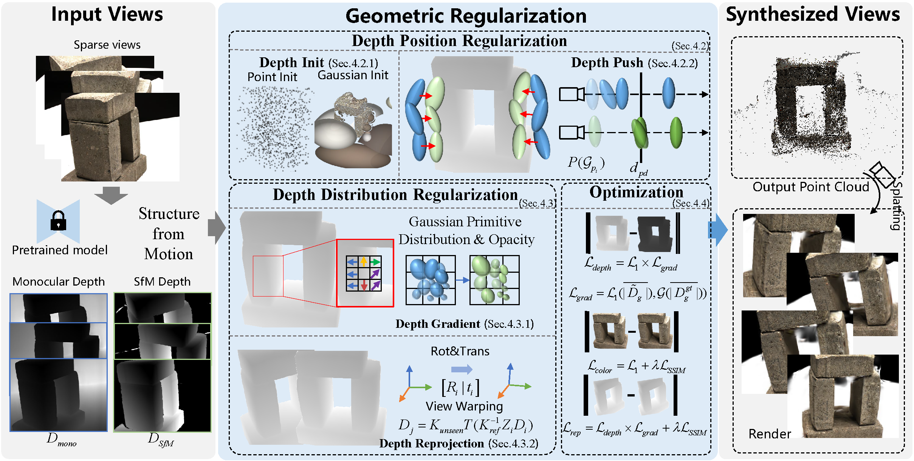

# DGC-GS: Enhancing Geometric Consistency in Sparse-View 3D Gaussian Splatting

This is the official repository for paper **DGC-GS: Enhancing Geometric Consistency in Sparse-View 3D Gaussian Splatting**.





## Installation

Tested on Ubuntu 20.04, CUDA 11.6, PyTorch 1.12.1

``````
conda env create --file environment.yml
conda activate dgcgs

cd submodules
pip install ./diff-gaussian-rasterization ./simple-knn
``````

If encountering installation problem of the `diff-gaussian-rasterization` or `gridencoder`, you may get some help from [gaussian-splatting](https://github.com/graphdeco-inria/gaussian-splatting) and [torch-ngp](https://github.com/ashawkey/torch-ngp).


## Evaluation

### LLFF

1. Download LLFF from [the official download link](https://drive.google.com/drive/folders/128yBriW1IG_3NJ5Rp7APSTZsJqdJdfc1).

2. Generate monocular depths by DPT:
   put prepare_depth.py in Depth-Anything-V2/ folder.
   ```bash
   cd dpt
   git clone https://github.com/DepthAnything/Depth-Anything-V2
   cd Depth-Anything-V2
   python prepare_depth.py -b LLFF -r $<dataset_path_for_llff> -o $<dataset_outpath_for_llff>
   ```
3. Depth alignment:
   Run the Colmap convert as [FSGS](https://github.com/VITA-Group/FSGS)
   ```bash
   python colmap_convert.py --root_path $<dataset_path_for_llff> --output_path $<dataset_outpath_for_llff>
   ```
   Convert colmap bins to depth maps:
   ```bash
   python colmap_bin2_depth.py
   ```
   Generate mask with llff_mask_depth.py
   ```bash
   python llff_mask_depth.py
   ```
   Final Depth Alignment:
   ```bash
   python align_depth.py
   ```
4. Start training and testing:

   ```bash
   # for example
   bash scripts/run_llff.sh data/llff/fern output/llff/fern ${gpu_id} ./config/llff.ini 6000
   ```

### DTU

1. Download DTU dataset

   - Download the DTU dataset "Rectified (123 GB)" from the [official website](https://roboimagedata.compute.dtu.dk/?page_id=36/), and extract it.
   - Download masks (used for evaluation only) from [this link](https://drive.google.com/file/d/1Yt5T3LJ9DZDiHbtd9PDFNHqJAd7wt-_E/view?usp=sharing).


2. Organize DTU for few-shot setting

   ```bash
   bash scripts/organize_dtu_dataset.sh $rectified_path
   ```

3. Format

   - Poses: following [gaussian-splatting](https://github.com/graphdeco-inria/gaussian-splatting), run `convert.py` to get the poses and the undistorted images by COLMAP.
   - Render Path: following [LLFF](https://github.com/Fyusion/LLFF) to get the `poses_bounds.npy` from the COLMAP data. (Optional)


4. Generate monocular depths by DPT:

   ```bash
   cd dpt/Depth-Anything-V2
   python prepare_depth.py -b DTU -r $<dataset_path_for_dtu> -o $<dataset_outpath_for_dtu>
   ```

5. Set the mask path and the expected output model path in `copy_mask_dtu.sh` for evaluation. (default: "data/dtu/submission_data/idrmasks" and "output/dtu") 

6. Depth alignment:
   
   Similar to the LLFF process,
   ```bash
   python colmap_dtu.sh $scan_id $min_depth_percentile $max_depth_percentile $input $output
   ```

6. Start training and testing:

   ```bash
   # for example
   bash scripts/run_dtu.sh data/dtu/scan40 output/dtu/scan40 ${gpu_id} scan40 config/dtu.ini 6000
   ```


### Blender

1. Download the NeRF Synthetic dataset from [here](https://drive.google.com/drive/folders/128yBriW1IG_3NJ5Rp7APSTZsJqdJdfc1?usp=sharing).

2. Generate monocular depths by DPT:

   ```bash
   cd dpt
   python get_depth_map_for_blender.py --root_path $<dataset_path_for_blender>
   ```

3. Start training and testing:

   ```bash
   # for example
   # there are some special settings for different scenes in the Blender dataset, please refer to "run_blender.sh".
   bash scripts/run_blender.sh data/nerf_synthetic/drums output/blender/drums ${gpu_id}
   ```


## Reproducing Results
Due to the randomness of the densification process and random initialization, the metrics may be unstable in some scenes, especially PSNR.


### Checkpoints and Results
Coming soon...


## Customized Dataset
Similar to Gaussian Splatting, our method can read standard COLMAP format datasets. Please customize your sampling rule in `scenes/dataset_readers.py`, and see how to organize a COLMAP-format dataset from raw RGB images referring to our preprocessing of DTU.


## Citation


## Acknowledgement

This code is developed on [DNGaussian](https://github.com/Fictionarry/DNGaussian) with [simple-knn](https://gitlab.inria.fr/bkerbl/simple-knn) and a modified [diff-gaussian-rasterization](https://github.com/ashawkey/diff-gaussian-rasterization). The implementation of neural renderer are based on [torch-ngp](https://github.com/ashawkey/torch-ngp). Codes about [DPT](https://github.com/DepthAnything/Depth-Anything-V2) are partial from [SparseNeRF](https://github.com/Wanggcong/SparseNeRF). Thanks for these great projects!
